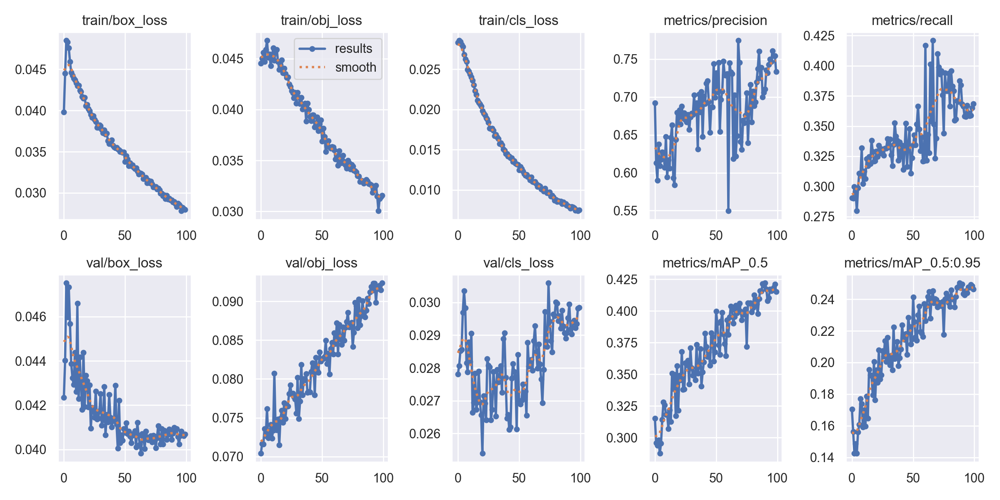
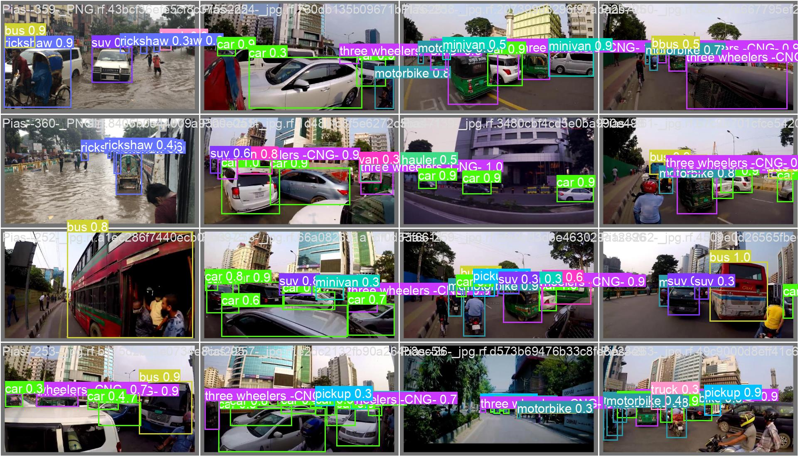
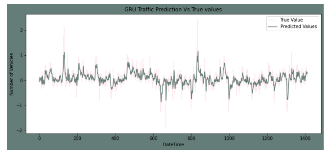

# ASTMS : Autonomous Smart Traffic Management Systems
**ASTMS : Autonomous Smart Traffic Management System Leveraging Artificial Intelligence CNN and Long Short Term Memory**

  In this modern world , Artificial Intelligence (AI) development have helped improvement in a lot of area , including automation , computer vision , fraud detection and others. Artificial Intelligence can be leveraged to increase ASTM and de- crease ASTM Congestion Rate. This paper presents Autonomous STM using Artificial Intelligence to increase Traffic Management congestion flow rate. Autonomous Smart Traffic Managements System used YOLO V5 Convolutional Neural Network to detects Traffic Vehicles in Smart Traffic Management Images. Then Autonomous Smart Traffic Management predicts Traffic Vehicles next 12 hours using Recurrent Neural Network Long Short Term Memories. Smart Traffic Management Cycle Length Analysis Manage Smart Traffic Management Cycle Length based on Traffic Vehicles Prediction using Artificial Intelligence. 

  From Result of Recurrent Neural Network Long Short Term Memory to Predict Traffic Vehicles in Next 12 Hours We Can see that Recurrent Neural Network Long Short Term Memory Can predict Traffic Vehicles in Next 12 Hours with Mean Squarred Error 4.521 Vehicles and Root Mean Squared Error ( RMSE ) 2.232 Vehicles. After Simulation of STM in ASTM Simulation CARLA We got Traffic Management Congestion Flow Rate with ASTM ( 21 Vehicles / Minutes ) is 50 % Higher than Traffic Management Congestion Rate without STM ( Around 15 Vehicles / Minute ) and Traffic Management Vehicles Pass Delay with STM ( 5 Seconds / Vehicles ) are 70 % Less Than Traffic Management Vehicles Pass Delay without STM ( Around 12 Seconds / Vehicles ). Then We Can See that STM using Artificial Intelligence can increase Traffic Management Congestion Flow Rate with 50 % Traffic Management Congestion Flow Rate and decrease Traffic Management Vehicles Pass Delay with 70 % Traffic Management Vehicles Pass Delay.

## Tuning Hyperparameter YOLO V5 Convolutional Neural Network to Detect Smart Traffic Management
First Writer Tuning Hyperparameter YOLO V 5 Convolutional Neural Network to Detect Smart Traffic Management System Vehicles. Tuning Hyperparameter YOLO V5 Convolutional Neural Network to Detect Smart Traffic Management System Vehicles Can Be Seen in Figure 8.

From the Result Table of Tuning Hyperparameter YOLO V5 Convolutional Neural Network to Detect Smart Traffic Management Vehicles in Smart Traffic Management Images We Can See the best Tuning Hyperparameter are Tuning Hyperparameter Search 1 with Parameter Learning Rate 0 0.0052 , Parameter Momentum 0.595 , Parameter Mosaic 0.36 , Parameter Degrees 72 , Parameter Scale 1.32 , and Parameter Weight Decay 0.0005 with Mean Average Precision 0.4034 that is Almost 50 % more higher than other Tuning Hyperparameter YOLO V5 Convolutional Neural Network to Detect Smart Traffic Management Vehicles in Smart Traffic Management Images ( Around 0.2852 ). Result of Best Tuning Hyperparameter YOLO V5 Convolutional Neural Network to Detect Smart Traffic Management Vehicles in Smart Traffic Management Images can be seen as below.

## Predicting Smart Traffic Management Vehicles using YOLO V5 Convolutional Neural Network

From Training YOLO V5 Convolutional Neural Network Best Tuning Hyperparameter to Detect Smart Traffic Man- agement Vehicles in Smart Traffic Management Images We Can Have YOLO V5 Convolutional Neural Network Best Tuning Hyperparameter can detect Smart Traffic Management Vehicles in Smart Traffic Management Images with Mean Average Precision 0.88561 and Mean Average Precision for Predicting Smart Traffic Management Cars in Smart Traffic Management Images is 0.95251. From Training YOLO V5 Convolutional Neural Network Best Tuning Hyperparameter Training Loss We Can See that YOLO V5 Convolutional Neu- ral Network Best Tuning Hyperparameter have Loss 0.0010 that is 50 % lower than YOLO V5 Convolutional Neural Network Best Tuning Hyperparameter Loss in Epoch 1 ( around 0.0250 ) because YOLO V5 Convolutional Neural Network Best Tuning Hyperparameter training YOLO V5 Convolutional Neural Network well. 

We Can also see that YOLO V5 Convolutional Neural Network Best Tuning Hyper- parameter Validation loss is 0.0020 that is same with YOLO V5 Convolutional Neural Network Best Tuning Hyperparam- eter Training loss ( aroound 0.0025 ) because YOLO V5 Convolutional Neural Network Best Tuning Hyperparameter uses Best Tuning Hyperparameter to Detect Smart Traffic Management Vehicles in Smart Traffic Management Images so there is no Overfitting in YOLO V5 Convolutional Neural Network Best Tuning Hyperparameter to Detect Smart Traffic Management Vehicles in Smart Traffic Management Images. The YOLO V5 Convolutional Neural Network Best Tuning Hyperparameter to Detect Smart Traffic Management Vehicles in Smart Traffic Management Images can be seen in Figure 10.

## Predicting Smart Traffic Management Vehicles Next 12 Hours using Recurrent Neural Network Long Short Term Memory

Then Writer training Recurrent Neural Network Long Short Term Memory to predict Smart Traffic Management Vehicles. Writer training Recurrent Neural Network Long Short Term Memory to predict Smart Traffic Management Vehicles in next 12 hours using Recurrent Neural Network Long Short Term Memory using Number of Traffic Management Vehicles last hour , Year of Traffic Management Vehicles , Month of Traffic Management Vehicles , Day of Traffic Management Vehicles , Hour of Traffic Management Vehicles and Minutes of Traffic Management Vehicles. The Result of Recurrent Neural Network Long Short Term Memory to predict Smart Traffic Management Vehicles Next 12 Hours can be seen as below. From Result of Recurrent Neural Network Long Short Term Memory to Predict Smart Traffic Management Vehicles in Next 12 Hours We Can see that Recurrent Neural Network Long Short Term Memory Can predict Smart Traffic Manage- ment Vehicles in Next 12 Hours with Mean Squarred Error 4.521 Vehicles and Root Mean Squared Error ( RMSE ) 2.232 Vehicles. From Result of Recurrent Neural Network Long Short Term Memory to predict Smart Traffic Management Vehicles in Next 12 Hours We Can See that Recurrent Neural Network Long Short Term Memory to Predict Smart Traffic Management Vehicles in Next 12 Hours can predict increase and decrease of Smart Traffic Management Vehicles in next 12 hours.

|[ alt text ](./Figure_of_Autonomous_Smart_Traffic_Managements_Projects/Fig%2014%20Result%20of%20Recurrent%20Neural%20Network%20Long%20Short%20Term%20Memory%20Predicts%20Smart%20Traffic%20Management%20Vehicles%20Next%2012%20Hours.png )

## Evaluating Smart Traffic Management Vehicles using Smart Traffic Management Simulator CARLA

Then Writer evaluate Smart Traffic Management System using Artificial Intelligence using Traffic Management Sim- ulator CARLA. In evaluate Smart Traffic Management Sys- tem using Artificial Intelligence using Traffic Management Simulator CARLA Writer evaluates 100 Scenarios of Smart Traffic Management Vehicles in each day by using Smart Traffic Management System using Artificial Intelligence and by using Traffic Management System. The Evaluation of Smart Traffic Management System using Artificial Intelligence using Simulator CARLA can be seen as below. After Simulation of Smart Traffic Management System in Traffic Management System Simulation CARLA We got Traffic Management Congestion Flow Rate with Traffic Man- agement System ( 21 Vehicles / Minutes ) is 50 % Higher than Traffic Management Congestion Rate without Smart Traffic Management System ( Around 15 Vehicles / Minute ) and Traffic Management Vehicles Pass Delay with Smart Traffic Management System ( 5 Seconds / Vehicles ) are 70 % Less Than Traffic Management Vehicles Pass Delay without Smart Traffic Management System ( Around 12 Seconds / Vehicles ). Then We Can See that Smart Traffic Management System using Artificial Intelligence can increase Traffic Management Congestion Flow Rate with 50 % Traffic Management Conges- tion Flow Rate and decrease Traffic Management Vehicles Pass Delay with 70 % Traffic Management Vehicles Pass Delay. In the Simulation of Smart Traffic Management System in Traffic Management Simulator CARLA We Can Have Smart Traffic Management System using Artificial Intelligence can increase Traffic Management Congestion Rate significantly and decrease Traffic Management Vehicles Pass Delay signifi- cantly when the number of Smart Traffic Management System Vehicles is more than 10 Smart Traffic Management System Vehicles.

This paper presents Autonomous Smart Traffic Manage- ment System using Artificial Intelligence to increase Traffic Management congestion flow rate. Autonomous Smart Traffic Managements System used YOLO V5 Convolutional Neural Network to detects Smart Traffic Management Vehicles in Smart Traffic Management Images. Autonomous Smart Traffic Management System tuning Hyperparameter of Learning Rate Start , Momentum YOLO V5 , Mosaic Parameter YOLO V5 , Rotation Degree Parameter YOLO V5 , Scale ParameterYOLO V5 and Weight Decay Parameter YOLO V5. From the Result Table of Tuning Hyperparameter YOLO V5 Convolu- tional Neural Network to Detect Smart Traffic Management Vehicles in Smart Traffic Management Images We Can See the best Tuning Hyperparameter are Tuning Hyperparameter Search 1 with Parameter Learning Rate 0 0.0052 , Parameter Momentum 0.595 , Parameter Mosaic 0.36 , Parameter De- grees 72 , Parameter Scale 1.32 , and Parameter Weight Decay 0.0005 with Mean Average Precision 0.4034 that is Almost 50 % more higher than other Tuning Hyperparameter YOLO V5 Convolutional Neural Network to Detect Smart Traffic Management Vehicles in Smart Traffic Management Images ( Around 0.2852 ). From Training YOLO V5 Convolutional Neural Network Best Tuning Hyperparameter to Detect Smart Traffic Management Vehicles in Smart Traffic Management Images We Can Have YOLO V5 Convolutional Neural Net- work Best Tuning Hyperparameter can detect Smart Traffic Management Vehicles in Smart Traffic Management Images with Mean Average Precision 0.88561 and Mean Average Precision for Predicting Smart Traffic Management Cars in Smart Traffic Management Images is 0.95251. Then Autonomous Smart Traffic Management predicts Smart Traffic Management Vehicles next 12 hours using Recurrent Neural Network Long Short Term Memories. 

Writer training Recurrent Neural Network Long Short Term Memory to predict Smart Traffic Management Vehicles in next 12 hours using Recurrent Neural Network Long Short Term Memory using Number of Traffic Management Vehicles last hour , Year of Traffic Management Vehicles , Month of Traffic Management Vehicles , Day of Traffic Management Vehicles , Hour of Traffic Management Vehicles and Minutes of Traffic Management Vehicles. From Result of Recurrent Neural Network Long Short Term Memory to Predict Smart Traffic Management Vehicles in Next 12 Hours We Can see that Recurrent Neural Network Long Short Term Memory Can predict Smart Traffic Management Vehicles in Next 12 Hours with Mean Squarred Error 4.521 Vehicles and Root Mean Squared Error ( RMSE ) 2.232 Vehicles. From Result of Recurrent Neural Network Long Short Term Memory to predict Smart Traffic Management Vehicles in Next 12 Hours We Can See that Recurrent Neural Network Long Short Term Memory to Predict Smart Traffic Management Vehicles in Next 12 Hours can predict increase and decrease of Smart Traffic Management Vehicles in next 12 hours. Then Autonomous Smart Traffic Management evaluates Smart Traffic Management System using Artificial Intelligence using Traffic Management Simulator CARLA. After Simula- tion of Smart Traffic Management System in Traffic Manage- ment System Simulation CARLA We got Traffic Management Congestion Flow Rate with Traffic Management System ( 21 Vehicles / Minutes ) is 50 % Higher than Traffic Management Congestion Rate without Smart Traffic Management System ( Around 15 Vehicles / Minute ) and Traffic Management Vehicles Pass Delay with Smart Traffic Management System ( 5 Seconds / Vehicles ) are 70 % Less Than Traffic Management Vehicles Pass Delay without Smart Traffic Management Sys- tem ( Around 12 Seconds / Vehicles ). 

Then We Can See that Smart Traffic Management System using Artificial Intelligence can increase Traffic Management Congestion Flow Rate with 50 % Traffic Management Congestion Flow Rate and decrease Traffic Management Vehicles Pass Delay with 70 % Traffic Management Vehicles Pass Delay. In the Simulation of Smart Traffic Management System in Traffic Management Simulator CARLA We Can Have Smart Traffic Management System using Artificial Intelligence can increase Traffic Management Congestion Rate significantly and decrease Traffic Manage- ment Vehicles Pass Delay significantly when the number of Smart Traffic Management System Vehicles is more than 10 Smart Traffic Management System Vehicles. Then We can see Autonomous Smart Traffic Management System can predicts number of Smart Traffic Management Vehicles next 12 hours with Mean Squarred Error 4.521 Vehi- cles and Root Mean Squared Error ( RMSE ) 2.232 Vehicles. Autonomous Smart Traffic Management System can Traffic Management Congestion Flow Rate with Traffic Management System ( 21 Vehicles / Minutes ) is 50 % Higher than Traffic Management Congestion Rate without Smart Traffic Management System ( Around 15 Vehicles / Minute ) and Traffic Management Vehicles Pass Delay with Smart Traffic Management System ( 5 Seconds / Vehicles ) are 70 % Less Than Traffic Management Vehicles Pass Delay without Smart Traffic Management System ( Around 12 Seconds / Vehicles ). Then We Can See that Smart Traffic Management System using Artificial Intelligence can increase Traffic Management Congestion Flow Rate with 50 % Traffic Management Conges- tion Flow Rate and decrease Traffic Management Vehicles Pass Delay with 70 % Traffic Management Vehicles Pass Delay. In the Simulation of Smart Traffic Management System in Traffic Management Simulator CARLA We Can Have Smart Traffic Management System using Artificial Intelligence can increase Traffic Management Congestion Rate significantly and decrease Traffic Management Vehicles Pass Delay signifi- cantly when the number of Smart Traffic Management System Vehicles is more than 10 Smart Traffic Management System Vehicles.

